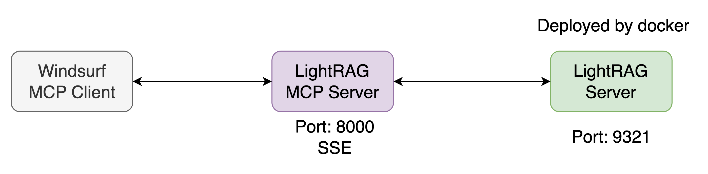

# LightRAG MCP Server

[](https://www.python.org/downloads/)
[](https://opensource.org/licenses/MIT)

MCP server for integrating LightRAG with AI tools. Provides a unified interface for interacting with LightRAG API through the MCP protocol. This server acts as a bridge between LightRAG's powerful retrieval-augmented generation capabilities and MCP-compatible clients.

## Description

LightRAG MCP Server is a bridge between LightRAG API and MCP-compatible clients. It allows using LightRAG (Retrieval-Augmented Generation) capabilities in various AI tools that support the MCP protocol.

### Key Features

- **Information Retrieval**: Execute semantic and keyword queries to documents
- **Document Management**: Upload, index, and track document status
- **Knowledge Graph Operations**: Manage entities and relationships in the knowledge graph
- **Monitoring**: Check LightRAG API status and document processing

## Deployment



### Prerequisites
- Docker and Docker Compose installed on your system
- LightRAG API server running (see Integration section below)

### Running with Docker

1. **Build the Docker image**
   ```bash
   docker build -t lightrag-mcp .
   ```

2. **Run the container**
   ```bash
   docker run -d \
     --name lightrag-mcp \
     -p 8000:8000 \
     -e LIGHTRAG_API_URL=http://host.docker.internal:9621 \
     lightrag-mcp
   ```

   > **Note**: The `host.docker.internal` assumes you're running LightRAG API on your host machine. For Linux, you might need to use `--network="host"` instead.

### Environment Variables

| Variable | Description | Default |
|----------|-------------|---------|
| `LIGHTRAG_API_URL` | URL of the LightRAG API server | `http://host.docker.internal:9621` |
| `LIGHTRAG_API_KEY` | API key for authentication (if required) | `` |
| `PORT` | Port to run the MCP server on | `8000` |

### Configuration File

Create a `.env` file in the project root with the following variables:

```env
# LightRAG Server Configuration
LIGHTRAG_API_HOST=localhost
LIGHTRAG_API_PORT=9621
LIGHTRAG_API_KEY=""

# Optional: Uncomment and modify if needed
# LIGHTRAG_API_BASE_URL=http://localhost:9621
```

### Local Development

If you prefer to run locally without Docker:

```bash
# Create a virtual environment
conda create -n lightrag python=3.10
conda activate lightrag

# Install dependencies
pip install -r requirements.txt

# Install library
pip install -e .

# Copy .env.example
cp .env.example .env


# Run server
# uvicorn src.lightrag_mcp.main:app --host 0.0.0.0 --port 8000
python src/lightrag_mcp/main.py
```

## Usage

**Important**: LightRAG MCP server should only be run as an MCP server through an MCP client configuration file (mcp-config.json).

### Setting up as MCP server

To set up LightRAG MCP as an MCP server, add the following configuration to your MCP client configuration file (e.g., `mcp-config.json`):

#### Using uvenv (uvx):

```json
{
  "mcpServers": {
    "lightrag-mcp": {
      "serverUrl": "http://localhost:8000/sse"
    }
  }
}
```

The SSE endpoint at http://localhost:8000/sse

## Available MCP Tools

### Document Queries
- `query_document`: Execute a query to documents through LightRAG API

### Document Management
- `insert_document`: Add text directly to LightRAG storage
- `upload_document`: Upload document from file to the /input directory
- `insert_file`: Add document from file directly to storage
- `insert_batch`: Add batch of documents from directory
- `scan_for_new_documents`: Start scanning the /input directory for new documents
- `get_documents`: Get list of all uploaded documents
- `get_pipeline_status`: Get status of document processing in pipeline

### Knowledge Graph Operations
- `get_graph_labels`: Get labels (node and relationship types) from knowledge graph
- `create_entities`: Create multiple entities in knowledge graph
- `edit_entities`: Edit multiple existing entities in knowledge graph
- `delete_by_entities`: Delete multiple entities from knowledge graph by name
- `delete_by_doc_ids`: Delete all entities and relationships associated with multiple documents
- `create_relations`: Create multiple relationships between entities in knowledge graph
- `edit_relations`: Edit multiple relationships between entities in knowledge graph
- `merge_entities`: Merge multiple entities into one with relationship migration

### Monitoring
- `check_lightrag_health`: Check LightRAG API status